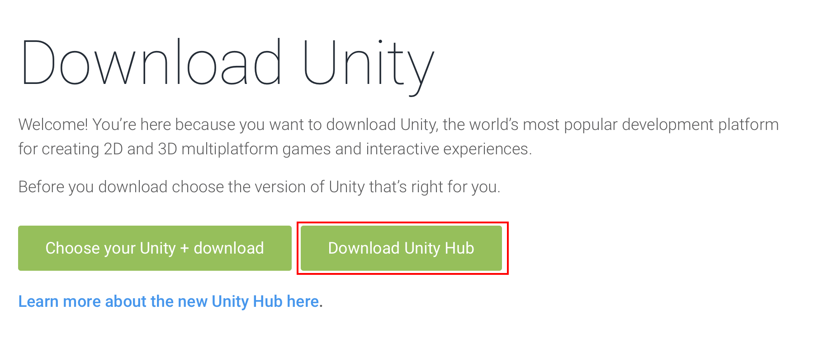
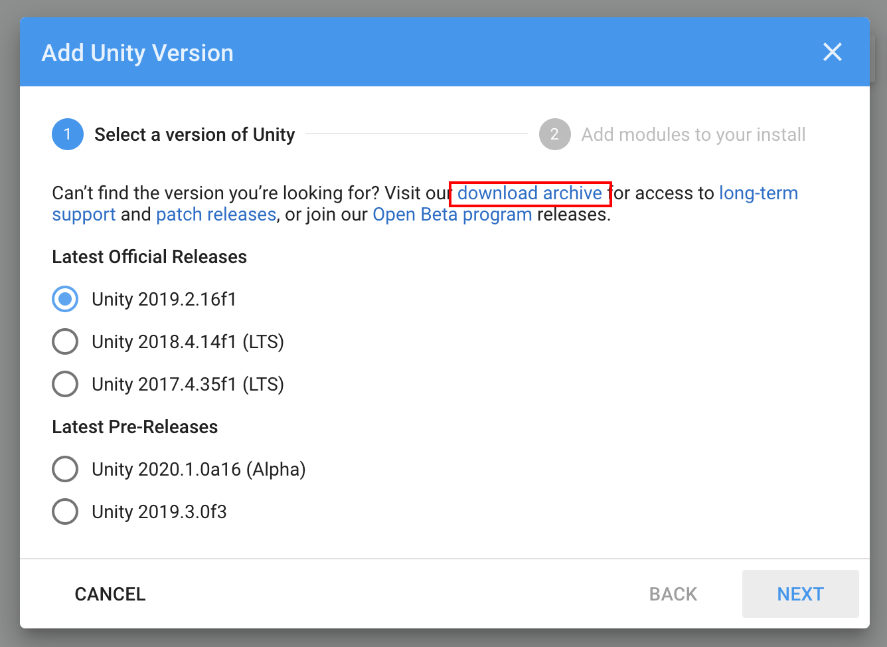
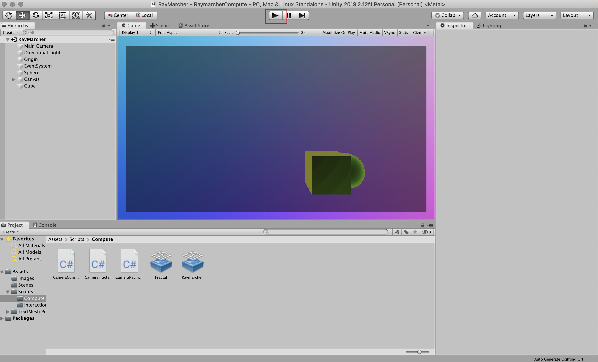

# Graphics Term Project

## 3D Mandelbulb Visualizer and Raymarching Demo

Using ray marching, a volume rendering technique similar to raytracing, draw a 3D fractal onto the screen.  The program will be able to orbit the volume with a camera and change the color and power (complexity levels) of the fractal. The fractal drawn will be a mandelbulb and it will be drawn by taking advantage of modern graphics hardware. The program will also act as a learning opportunity for shaders in general and will have interactive demos to better understand how they work. Finally, the program will utilize Unity3D, a popular game engine, to handle the compilation of compute shaders to different platforms and provide some low-level matrix transformations of the camera. Instructions on using the project files will be provided.

### Installation Instructions:

Install Unity Hub, if not installed.  (This helps to manage version number and install/edit the features installed in the application). You will need a unity id to use this software, this can be made for free as long as you're using the personal version of Unity.

https://unity3d.com/get-unity/download

In the Installs tab of Unity Hub, add a new installation.  You may be required to sign in at this point.

To install version 2019.2.12f1 go to legacy downloads and select the unity hub install option for the version. 

Newer versions may work but this can not be guaranteed. 
include build support for your operating system in the install.

Wait for install.
Clone the Github repository.

On the projects tab in Unity Hub, go to add.

Navigate to the project folder on your drive (This is the folder that contains the Assets, Library, Logs, etc. folders and the sln file). 

Provided you have installed unity version 2019.2.12f1 there should be no error in opening the project. Click on the project name to open.

To run click the play button with the starting scene open. The play button will start on whatever scene is open.  All scenes can be found in the scenes folder in the asset window.

To Build go to File -> Build Settings -> Build.

For those on windows 10, RAMARCHERWIN.zip contains the application.  Unzip onto your computer and open the application, RaymarcherCompute, to run.

For those on MACos, RAYMARCHERMACos.zip contains the applications as well.  Unzip and run.

Pressing 'Esc' from the top level menu exits the application.

### Project Instructions:

On opening the project there are really only two scripts that will control the rendering of each scene.  There is a script on the camera object, that passes variables into and dispatches the compute shader. Other scripts may be added to allow for user control of the parameters passed to the compute shader.

### Other Reference Materials:

Additional links:

The Unity game engine:
https://unity.com

An explanation and introduction to ray marching:
http://jamie-wong.com/2016/07/15/ray-marching-signed-distance-functions/ 

Mandelbulb:
https://en.wikipedia.org/wiki/Mandelbulb

Ray tracing implemented on the gpu in Unity (similar technique to ray marching)
http://blog.three-eyed-games.com/2018/05/03/gpu-ray-tracing-in-unity-part-1/

For an overview of Unity and the interface see:
https://learn.unity.com

For UNity's documentation on compute shaders see:
https://docs.unity3d.com/Manual/class-ComputeShader.html
